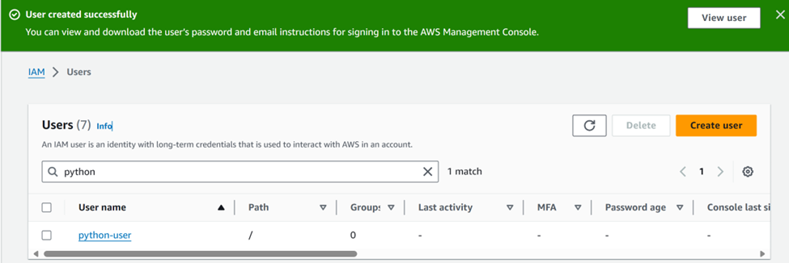
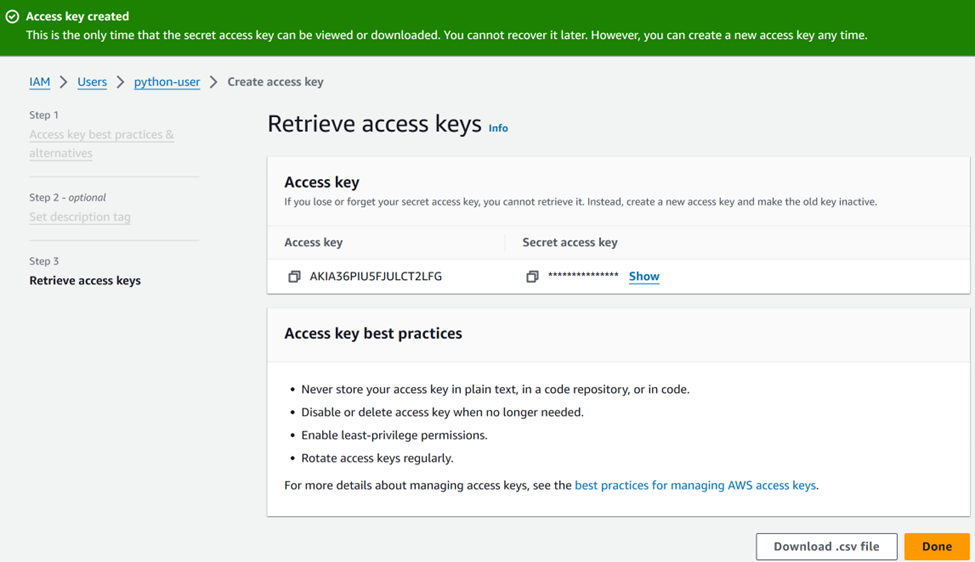
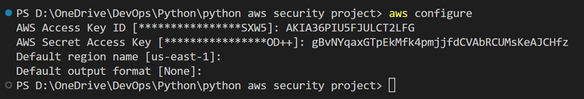
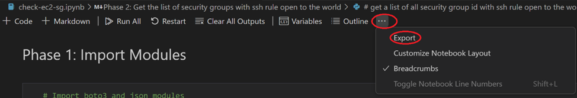
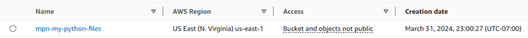
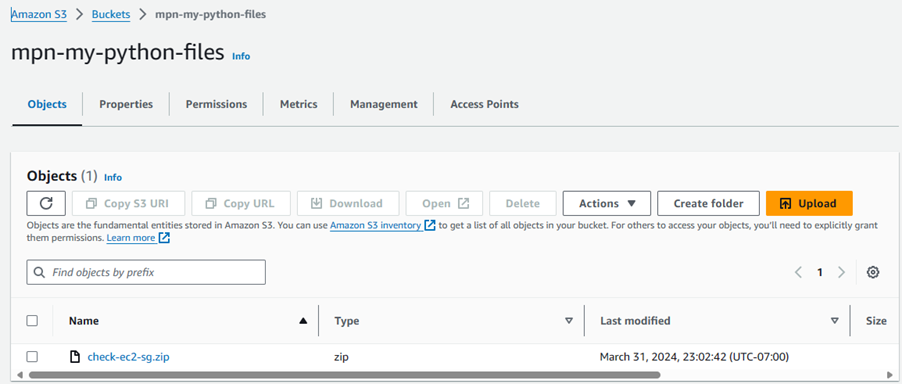
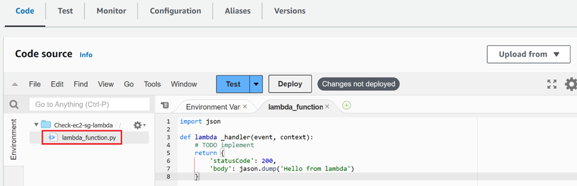
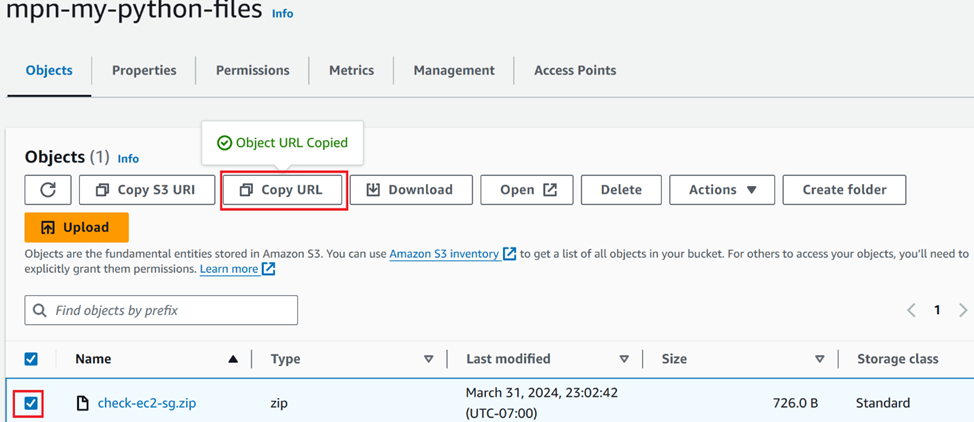

# PYTHON Amazon Web Services (AWS) SECURITY PROJECT for Security Groups

## Summary
In this project, we will write a python code that scans all running EC2 instances and checks all security groups with an SSH rule open to the world, if any, it will shutdown the instance. We will then create a Lambda function, upload this code, and use an EventBridge as trigger. The event here is whenever an EC2 state changes to running state, the event will trigger the lambda function.
There are many other actions that we can do with the result such as modifying the rule, deleting the rule, etc.
One of the security best practice in AWS is never to allow an SSH rule open to the world (that is, port 22 is open to the cidr IPv4 0.0.0.0/0) 

NB: This code can be used in any account found in the region you define in the access key.
We will be using a windows computer for this project. We will also leverage on AWS documentation and Google search, it's always good to know where to find the right information when needed.

## Skills
AWS management Console, Lambda, IAM roles, EC2 instances, Security Groups, Python

## Brief run down steps
1. Install Python and Boto3
2. Install AWS CLI on your computer
3. Create an IAM user and add an access key with programmatic access
4. Configure this access key on our computer
5. Write the python code to terminate any ec2 instance with ssh open to the world.
6. Export our code and save it as a python file.
7. Create an S3 bucket and upload a zip version of the file from step 6.
8. Create an IAM role to ec2 access to Lambda function
9. Create a Lambda function, import our python file, and add a trigger

## Step 1: Install Python and Boto3
Searching in Google with keywords "how to install python", from the first results, we get the following link with details on how to install Python on windows https://www.python.org/download/, download the latest python and install on your computer
Next we will install Boto3, (the prerequisite is python 3.8 or later). AWS documentary can be found here (https://boto3.amazonaws.com/v1/documentation/api/latest/guide/quickstart.html#installation).
Run the command "pip install boto3"
How to confirm python and boto3 are installed, run the commands
- "python --version"
- "pip show boto3"

## Step 2: Install AWS CLI
AWS documentation on how to install AWS CLI can be found here (https://docs.aws.amazon.com/cli/latest/userguide/getting-started-install.html). To install AWS CLI, we can either download and run the msi installer (from https://awscli.amazonaws.com/AWSCLIV2.msi) or run the command "msiexec.exe /i https://awscli.amazonaws.com/AWSCLIV2.msi", and follow the installation instructions.

## Step 3: Create an IAM user and give it an access key
In order for Python to interact with our AWS account, we need to grant it access by configuring a default profile on AWS CLI with an Access Key 
- From AWS management console, search for IAM and click on IAM under services
- Select Users on your left, then click on Create user
- Give it a name (for our project, we will use "python-user")
- No need to grant it access to AWS concol management since we only want it to have an access key id and secret access key
- Click on "Attach policies" directly and select "AdministratorAccess" under policy name, scroll now and click next.
- review summary and create user. 
- Next, go to the user's profile either by clicking on "view user" or by navigating to Users and selecting the user name.
- In the user's profile, goto "security credentials" tab and scroll down
- Under "Access keys", click on Create access key
- Under "use case", select "Command Line Interface (CLI)", acknowledge and click next.
- Optionally, you can give a description, we will leave it blank and click Create access key. 
* Copy the Access key ID & secret access key and save in a very secure location, you can find more on best practice here https://docs.aws.amazon.com/IAM/latest/UserGuide/id_credentials_access-keys.html#securing_access-keys

## Step 4: Configure this Access key on our computer
We will configure this access key as a default profile and will be using the "us-east-1" region. Follow the AWS documentation here https://docs.aws.amazon.com/cli/latest/reference/configure/
- Open your windows terminal (NB: we can use powershell)
- run the command "aws configure"
- Copy and paste the Access Key ID
- Enter Secret Access Key
- We will leave the default output format blank. 

Once this is done, this creates/updates 2 files config and credentials files that can be found in the directory "C:\Users\<home>\.aws>" (where "home" here is your windows user profile name). config file will give you the aws profile name and the region, credentials file will give you the access key and secret access key, open these files with notepad to view its content.

## Step 5: Write the python code to terminate any ec2 instance with ssh open to the world.
We will be using the IDE Visual Studio Code, and also the jupiter notebook. The advantage of using jupiter notebook is that we can run our code a line at a time, this will enable us to easily identify any error early enough and diagnos ten fix it, which saves us time.
After we installed boto3, we need to look for the ec2 instance boto3 client. We can find this in the documentation here https://boto3.amazonaws.com/v1/documentation/api/latest/reference/services/ec2.html
Follow the code from the file "check-ec2-sg.ipynb" found in this repository.
Some useful information to use VS code and the jupyter:

In this step, we will break down our code into 4 phases;
- Phase 1: Import Modules
- Phase 2: Get the list of security groups with ssh rule open to the world
- Phase 3: Get the list of ec2 instance in active state that have the sg obtained from phase 2
- Phase 4: Take remedy actions

## Step 6: Export our code and save it as a python file.
- On the VS code page, click on the "..." symbol at top and select "Export"  
- save the file with extension ".py" (python file extension)
- open the file and clean up by removing all comments

## Step 7: Create an S3 bucket and upload a zip version of the file from step 6.
- Browse to the location of the python file
- compress it to zip format.
- login to aws account
- from the management console, search for S3 and select S3 under services
- create a new bucket in the region we want to run our lambda function (give it a uniquely identifiable name). 
- open the bucket and upload the python zipped file. 

## Step 8: Create an IAM role to ec2 access to Lambda function
- From aws management console, goto IAM services
- From the left side, select "Roles" and click "Create role"
- Select "AWS service" under trusted entity type
- Under use case, select "Lambda", and click Next
- Under "Add permissions", select "AmazonEC2FullAccess" (to give Lambda ec2 full access)
- Give the role a name and click Create role

## Step 9: Create a Lambda function, import our python file, and add a trigger
- From aws management console, goto Lambda service, and click "Create a function"
- Select "Author from scratch"
- Give it a name
- Under runtime, select "Python 3.12" (since our code is written in python as 3.12 is the latest supported version by aws as of this project time)
- Select "x86-64" under architecture
- Under Execution role, select "use an existing role" and select your role from the dropdown list
- under "code source" section, select and delete the code "lambda_function.py"
When you create a lambda function from scratch, it always comes with a default code, this will automatically be replaced by any code we upload. 
To upload our zip file, we have 2 options: upload from .zip file or from Amazon S3 bucket, either ways will work but in your workplace, you will mostly use the s3 bucket option for teamwork management
- click on "Upload from" and select from amazon s3 bucket
- copy the zip file "Object URL" from our bucket and paste under Amazon S3 URL link and click save. 
- We need to edit the handler settings to mach the name of our code.
- under Runtime settings, click Edit
- under Handler, update the name to <zip file name>.lambda_handler (replace "zip file name" with the name of your file without the extention)
We will now add a trigger that will launch the lambda function, in our case we will use cloudwatch eventbridge with a specitivc event action (ec2 instances goes into running state)
- click on trigger and select "EventBridge (CloudWatch Events)" under trigger source
- under rules, select "create new rule" and give it a name
- select "event pattern" for rule type
- Select "EC2" next "EC2 instance state-change notification"
- check the box "Details" and "state"
- select "running" under state dropdown list, and click add
Lastly we need the change the default timeout duration which is set to 3 sec, we will update it to 1 min
- under the configuration tab, goto general configuration, click edit, update to 1 min under timeout and save
